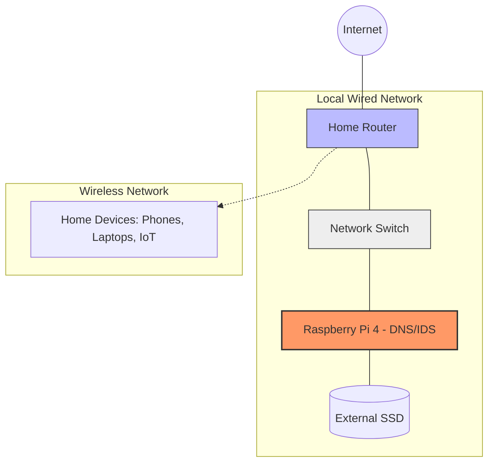

# Raspberry Pi IDS: Network Traffic Analysis & Threat detection 
This is a custom Suricata IDS running on a Raspberry Pi 4. This project focuses on learning defensive strategies and identifying attack surfaces on a common home network.

## Hardware & Environment
- **Platform:** Raspberry Pi 4 (4GB of RAM)
- **Storage:** External High-Speed Samsung T7 Shield SSD (logging)
- **OS:** Raspberry OS Lite (64-bit) 
- **Engine:** Suricata 7.0 (Custom compiled/Tuned)

## Current Monitoring Scope: DNS Security 
The IDS is currently configured as a passive DNS monitor. Since the individual devices aren't connected directly to the switch(but through the router). 
- **DNS tunneling:** detecting non-standard dns query load

## Defensive strategies 
- **Intrusion Prevention:** Configured **Fail2Ban** with a permanent ban policy for any IP exceeding 3 failed SSH attempts. This aims to
neutralize brute force attemps.
- **Stateful Firewall:** Deployed **UFW** with a zero trust policy. Access is strictly limited to DNS, SSH, and the EveBox dashboard.
- **Automated Patching:** Enabled `unattended-upgrades` to ensure the Pi receives critical security patches automatically.

## Topology 

## Disclaimer
This project is for educational and home-lab purposes only. Signatures are tuned for specific device behavior and may require adjustment for different network environments. 
